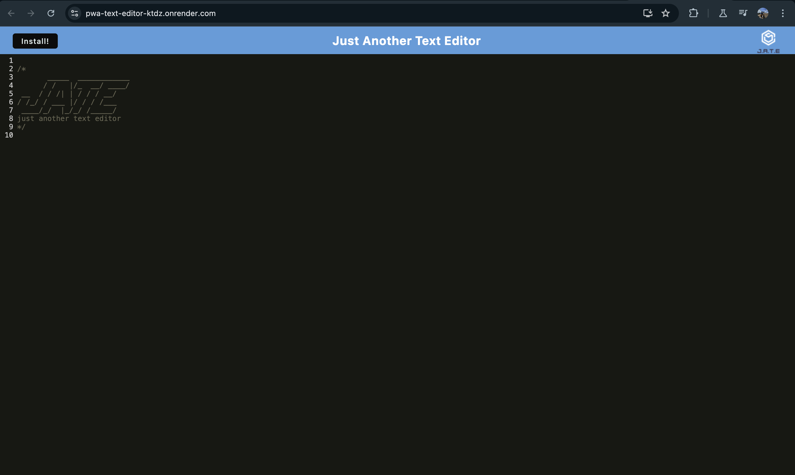
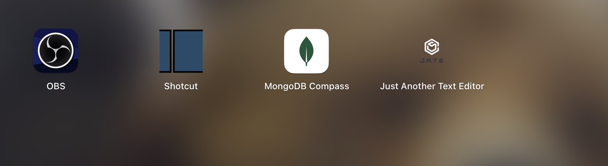
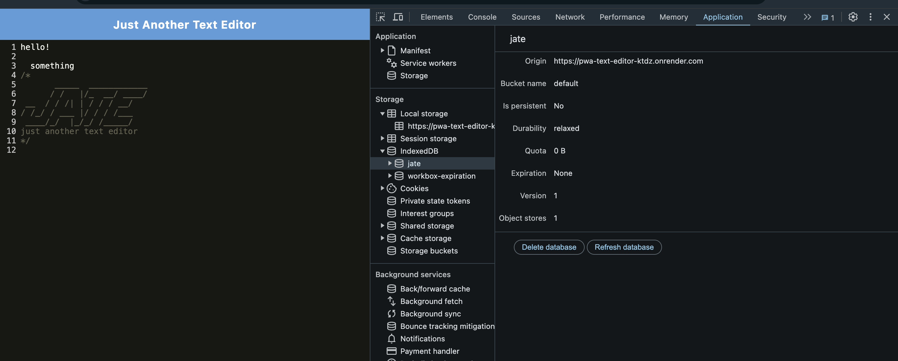
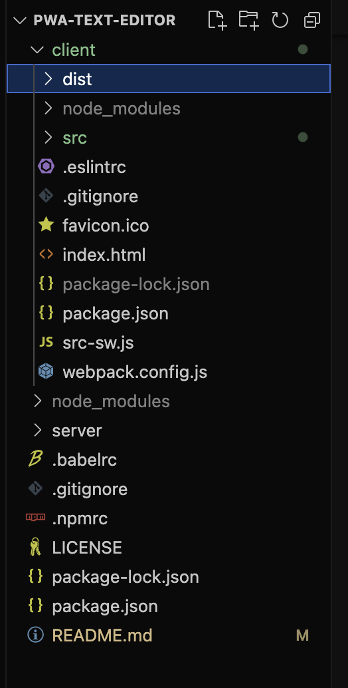
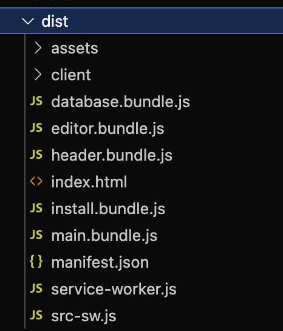

# JATE - PWA Text Editor

## Description

`JATE`, which stands for "Just Another Text Editor," is a progressive web application text editor that enables users to create and save notes both online and offline. Built using modern web technologies, `JATE` provides a seamless writing experience with features like customizable interface, offline editing capabilities, and cross-platform compatibility.

[Click here to view the deployed website!](https://pwa-text-editor-ktdz.onrender.com/) 🌐

## Table of Contents

* [Installation](#installation)
* [Usage](#usage)
* [Credits](#credits)
* [License](#license)

## Installation

To install and run `JATE` locally, follow these steps:

1. Clone this repository to your local machine by running:
~~~
git clone https://github.com/marcusmr15/pwa-text-editor.git
~~~

2. Navigate to the project directory using the terminal and install all necessary dependencies once in the root of the project by running:
~~~
npm i
~~~

3. Start the application by running this command in the root folder:
~~~
npm run start
~~~

4. Open a web browser and navigate to http://localhost:3000 to view the application.

## Usage

Once the application is running, you can start using `JATE` to create and edit text documents. Here are some key features and functionalities:

- __Offline Editing__: `JATE` allows users to create and edit text documents even when offline. Any changes made offline will be synchronized once back online. This is made possible thanks to `JATE` being a progressive web application (PWA).

- __IndexedDB Integration__: `JATE` uses IndexedDB for local storage. When you open the text editor, IndexedDB immediately creates a database storage. Any content entered is automatically saved to IndexedDB when you click off the DOM window. When you reopen the editor after closing it, the content is retrieved from IndexedDB.

- __Webpack Bundling__: All JavaScript files are bundled using Webpack, ensuring that the application runs smoothly in the browser without errors, even when using next-gen JavaScript.

- __Service Worker and Manifest__: `JATE` uses Workbox for service worker registration, ensuring that static assets are pre-cached upon loading. It also includes a generated HTML file, service worker, and a manifest file.

## Credits

This project was created by [Marcos Munoz](https://github.com/marcusmr15), with the help of:
* The `ChatGPT` AI developed by __Open AI__.
* The `Xpert Learning Assistant` AI developed by __edX__.
* The starter code from the [cautious-meme](https://github.com/coding-boot-camp/cautious-meme) repository by [Xander Rapstine](https://github.com/Xandromus). 
* The [19-PWA-Text-Editor](https://github.com/stellalph/19-PWA-Text-Editor) repository by [Stella Ling](https://github.com/stellalph). 

## License

MIT License.

